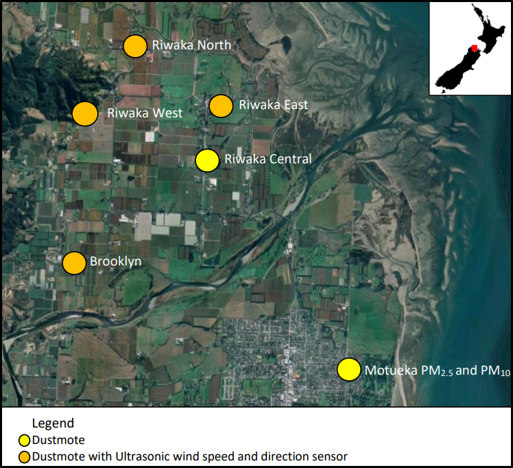

```{r setup, include = FALSE}
setwd(r"{C:\Users\matto\OneDrive - Tasman District Council\Desktop\R\Reporting\aq-report}")
source("load_data_and_plots.R", local = knitr::knit_global())
knitr::opts_chunk$set(warning = FALSE, message = FALSE) 
knitr::opts_chunk$set(echo = TRUE, fig.width = 7, fig.height = 5)
```

# Analysis of PM2.5 and Meteorological data collected by Mote Ltd, 2021

PM2.5 (μ/m3) for `r params$site` was collected at 1 minute intervals using a Met One ES642 near-forward optical nephelometer.

Wind Speed and Direction) were measured using a Gill Windsonic 60ultrasonic sensor.

Temperature data was not measured at the Site. Temperature from the Riwaka North site has been used for the analysis.

For more information on the monitoring regime refer to report Mote (2022), *"Riwaka, Brooklyn and Motueka PM2.5 monitoring network May-September 2021"*, dated 18 January 2022.

{width="50%"}

## Daily Averages

The peak daily average value of `r peak_daily_pm2p5` was recorded on 2021-06-03, just below the WHO 2021 guideline of 15.

```{r p1, include = TRUE, echo = FALSE}
ggplotly(p1)
```

## Diurnal Profile

Comparison of 3rd June diurnal profile to Winter 2021 diurnal profile.

```{r p2, include = TRUE, echo = FALSE}
ggplotly(p2)
```

## Temperature

Inspection of PM2.5 versus Temperature.

```{r p3, include = TRUE, echo = FALSE}
ggplotly(p3)
```

## Windrose

3rd June 2021 compared to Winter 2021

```{r p45, include = TRUE, echo = FALSE, fig.show="hold", out.width="70%"}

p4
p5
```
